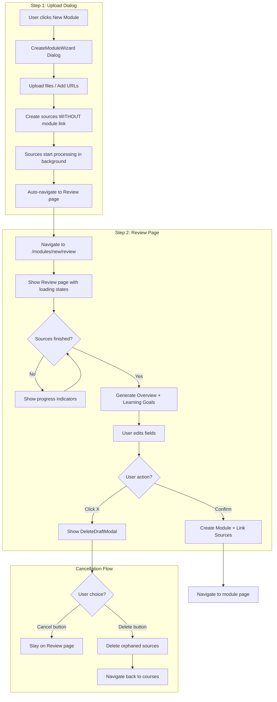

# Module Draft Creation Flow

## Architecture Overview




## State Management

Create a new Zustand store to hold the draft module state:

**File:** `frontend/src/lib/stores/module-draft-store.ts`

```typescript
interface ModuleDraftState {
  // Step tracking
  currentStep: 1 | 2
  
  // Source IDs being processed (not yet linked to module)
  pendingSourceIds: string[]
  sourceStatuses: Record<string, 'processing' | 'completed' | 'failed'>
  
  // Module fields (editable in Review step)
  name: string
  description: string
  overview: string | null
  dueDate: string | null
  prerequisites: string | null
  learningGoals: Array<{ description: string; order: number }>
  
  // Actions
  addPendingSource: (sourceId: string) => void
  updateSourceStatus: (sourceId: string, status: string) => void
  setModuleField: (field: string, value: any) => void
  reset: () => void
  
  // For cleanup on cancel
  getPendingSourceIds: () => string[]
}
```

## Frontend Changes

### 1. New Upload Dialog (Step 1)

**Modify:** `frontend/src/components/modules/CreateModuleDialog.tsx`

- Rename to `CreateModuleWizard.tsx`
- Keep as dialog for Step 1 (upload sources)
- Match Figma design (78:1434):
  - File upload zone with "Upload Your Syllabus Here"
  - ~~Source type buttons~~ (defer to later - just file upload for now)
- On file upload:
  - Call `sourcesApi.create()` with `modules: []` (no module link)
  - Store returned source ID in draft store
  - Source processing starts in background
  - **Auto-navigate** to `/modules/new/review` immediately after upload starts
  - Close dialog automatically (no "Next" button needed)

### 2. New Review Page (Step 2)

**Create:** `frontend/src/app/(dashboard)/modules/new/review/page.tsx`

Full-page layout matching Figma design (78:1222) - reuse logic from existing `ModuleDetails` component:

```
┌─────────────────────────────────────────────────────────────────────────────┐
│ ✕  Create Module > Review and Edit                                          │
├─────────────────────────────────────────────────────────────┬───────────────┤
│ Name                              │ Learning Goals           │ Files        │
│ [__________________]              │ ┌───────────────────────┐│ ┌─ ─ ─ ─ ─┐  │
│                                   │ │ + Add Learning Goal   ││ │    +    │  │
│ Overview                          │ ├───────────────────────┤│ └─ ─ ─ ─ ─┘  │
│ ┌─────────────────────────────┐   │ │ ⊗ Word Vectors    ▼ ││ ┌─────────┐  │
│ │ [AI-generated text...]      │   │ │ ⊗ Word Vectors    ▼ ││ │ thumb 1 │  │
│ │ [loading skeleton if        │   │ │ ⊗ Word Vectors    ▼ ││ │(loading)│  │
│ │  still processing]          │   │ └───────────────────────┘│ ├─────────┤  │
│ └─────────────────────────────┘   │                          │ │ thumb 2 │  │
│                                   │                          │ │  (done) │  │
│ Due Date                          │                          │ ├─────────┤  │
│ [January 8th, 2026      ]         │                          │ │   ...   │  │
│                                   │                          │ ├─────────┤  │
│ Prerequisites                     │                          │ │   +4    │  │
│ [None                   ]         │                          │ └─────────┘  │
├─────────────────────────────────────────────────────────────┴───────────────┤
│ [========================================          ]            [Confirm]   │
└─────────────────────────────────────────────────────────────────────────────┘
```

**Key features:**

- **Reuse `ModuleDetails` logic** - The existing component at `frontend/src/app/(dashboard)/modules/components/ModuleDetails.tsx` already has:
  - Name input
  - Overview textarea with auto-generation
  - Due Date and Prerequisites inputs
  - Learning Goals with auto-generation, add, edit, delete
- **Files sidebar on right** (Figma 85:976) - Shows uploaded files with processing status:
  - Dashed "+" button at top to add more files
  - File thumbnails showing upload/processing status
  - "+N" indicator for overflow when many files
- Poll source status every 2-3 seconds until all complete
- Show skeleton loaders for Overview/Learning Goals while sources process
- When sources complete, auto-generate Overview + Learning Goals
- Progress bar at bottom shows overall completion
- ~~"What would you like to change" chat section~~ (defer to later)

### 3. New Review Page Components

**Create:** `frontend/src/components/modules/review/`

- `ModuleReviewForm.tsx` - Main form layout (adapt from `ModuleDetails.tsx` to work with draft state instead of saved module)
- `FilesSidebar.tsx` - Right sidebar showing uploaded files with processing status (Figma 85:976):
  - "Files" header
  - Dashed "+" button to add more files
  - File thumbnail grid with status indicators (loading spinner, checkmark)
  - "+N" overflow indicator when many files
- `FileThumbnail.tsx` - Individual file thumbnail with status overlay

### 4. Delete Draft Confirmation Modal

**Create:** `frontend/src/components/modules/review/DeleteDraftModal.tsx`

Match Figma design (214:9776):

```
┌─────────────────────────────────────────────────────────────────┐
│                                                                 │
│         This draft will not be saved.                           │
│         Do you want to proceed?                                 │
│                                                                 │
│              [Cancel]          [Delete]                         │
│              (dark/teal)       (coral/red)                      │
│                                                                 │
└─────────────────────────────────────────────────────────────────┘
```

- Shown when user clicks X button or tries to navigate away from Review page
- **Cancel button** (dark): Closes modal, stays on Review page
- **Delete button** (coral/destructive): Deletes orphaned sources, navigates back to courses page

### 5. Source Status Polling Hook

**Create:** `frontend/src/lib/hooks/use-source-polling.ts`

```typescript
export function useSourcePolling(sourceIds: string[]) {
  // Poll /sources/{id}/status for each source
  // Return aggregated status and completion percentage
  // Stop polling when all complete or failed
}
```

### 6. Update Course Page Integration

**Modify:** `frontend/src/app/(dashboard)/courses/[courseId]/page.tsx`

- Update "+ New Module" button to open new wizard
- Pass `courseId` to wizard so it can be stored in draft state
- After confirmation, module is auto-assigned to course

## Backend Changes

### 1. Batch Source Deletion Endpoint

**Create:** `api/routers/sources.py` - Add new endpoint

```python
@router.post("/sources/batch-delete")
async def batch_delete_sources(source_ids: List[str]):
    """Delete multiple sources at once (for cleanup)."""
    for source_id in source_ids:
        source = await Source.get(source_id)
        if source:
            await source.delete()
    return {"deleted": len(source_ids)}
```

### 2. Generate Module Content Endpoint (Optional Enhancement)

If you want to generate Overview/Learning Goals before the module exists:

**Modify:** `api/routers/modules.py` - Add preview endpoint

```python
@router.post("/modules/preview-content")
async def preview_module_content(source_ids: List[str], name: str):
    """Generate overview and learning goals from sources without creating module."""
    # Fetch sources and their insights
    # Use existing prompt templates to generate content
    # Return generated content without saving
```

## Data Flow Summary


| Step | Frontend Action    | Backend Action                                                         | State Change                          |
| ---- | ------------------ | ---------------------------------------------------------------------- | ------------------------------------- |
| 1    | Open wizard dialog | -                                                                      | `currentStep: 1`                      |
| 2    | Upload file(s)     | `POST /sources` (no modules)                                           | `pendingSourceIds += [id]`            |
| 3    | Auto-navigate      | -                                                                      | Close dialog, navigate to review page |
| 4    | View review page   | Poll `GET /sources/{id}/status`                                        | Update `sourceStatuses`               |
| 5    | Sources complete   | `POST /modules/preview-content` or similar                             | Update overview/learningGoals         |
| 6    | Edit fields        | -                                                                      | Update draft store fields             |
| 7a   | Click Confirm      | `POST /modules`, then `POST /modules/{id}/sources/{sourceId}` for each | Clear draft, navigate to module       |
| 7b   | Click X (close)    | -                                                                      | Show DeleteDraftModal                 |
| 7c   | Modal: Cancel      | -                                                                      | Close modal, stay on review           |
| 7d   | Modal: Delete      | `POST /sources/batch-delete`                                           | Clear draft, navigate back to courses |


## Files to Create/Modify

**New files:**

- `frontend/src/lib/stores/module-draft-store.ts`
- `frontend/src/app/(dashboard)/modules/new/review/page.tsx`
- `frontend/src/components/modules/review/ModuleReviewForm.tsx` (adapt from `ModuleDetails.tsx`)
- `frontend/src/components/modules/review/FilesSidebar.tsx`
- `frontend/src/components/modules/review/FileThumbnail.tsx`
- `frontend/src/components/modules/review/DeleteDraftModal.tsx`
- `frontend/src/lib/hooks/use-source-polling.ts`

**Modified files:**

- `frontend/src/components/modules/CreateModuleDialog.tsx` → Rename and refactor to `CreateModuleWizard.tsx`
- `frontend/src/app/(dashboard)/courses/[courseId]/page.tsx` - Update to use new wizard
- `frontend/src/lib/api/sources.ts` - Add `batchDelete` function
- `api/routers/sources.py` - Add batch delete endpoint

## Edge Cases to Handle

1. **Browser close during draft** - Sources remain orphaned. Consider adding a cleanup job later or accepting this as minor technical debt.
2. **All sources fail processing** - Show error state on Review page with retry option.
3. **User clicks X or navigates away** - Show `DeleteDraftModal` confirmation before proceeding.
4. **Browser back button / beforeunload** - Intercept and show `DeleteDraftModal` to confirm abandonment.
5. **Course context lost** - Store `targetCourseId` in draft store so module is assigned correctly on confirm.

