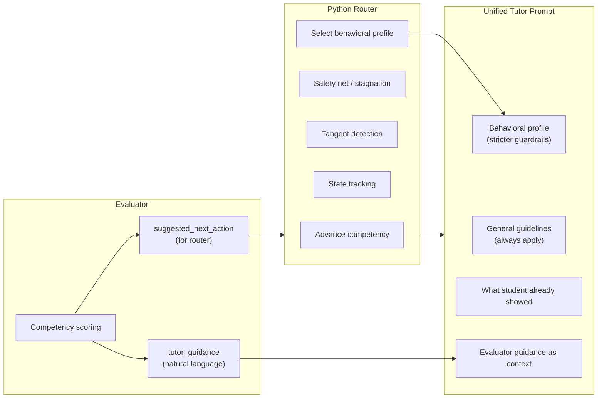

# Tutor Autonomy Redesign

## The Problem

The tutor is a mode-driven question machine. Every response is selected by a rigid mode block (socratic, nudge, macro_hint, explain_competency, transition) that dictates the exact response structure ("acknowledge + ask ONE question targeting the gap"). This produces robotic, repetitive exchanges where the tutor doesn't respond to what the student actually says — it responds to the competency gap.

The fix: the evaluator stays structured (scoring, tracking, guardrails), but the tutor becomes a conversation partner that receives the evaluator's assessment as context and responds naturally.

---

## Architecture Change

**Current flow:**

```
evaluator -> suggested_next_action -> router sets tutor_mode -> mode-specific prompt block -> response
```

**New flow:**

```
evaluator -> structured scoring + tutor_guidance -> router handles guardrails + selects behavioral profile -> unified tutor prompt (guidance + profile + general guidelines) -> natural response
```




---

## Change 1: Unified Tutor Prompt

**File:** `[prompts/tutor/tutor_turn.jinja](prompts/tutor/tutor_turn.jinja)`

Replace all mode blocks (nudge, socratic, macro_hint, explain_competency, transition) with a single unified prompt that has three layers of instruction:

1. **Evaluator's `tutor_guidance`** — specific, contextual recommendation (what to do)
2. **Behavioral profile** — mode-specific structural guardrails, appended by the router (how to do it)
3. **General guidelines** — always apply (baseline behavior)

The behavioral profile is stricter than the general guidelines and takes priority. The tutor follows the evaluator's guidance within the constraints of the behavioral profile.

**New prompt structure:**

```
# SYSTEM ROLE
You are a Socratic tutor in a one-on-one discussion...

# LEARNING GOAL
{{ goal.description }}
{{ goal.competencies }}
{{ goal.takeaways }}     <-- available always, not locked to explain mode

# ANCHOR PROBLEM
{{ anchor_problem }}

# WHAT THE STUDENT HAS ALREADY DEMONSTRATED
{{ demonstrated_knowledge }}    <-- NEW: prevents re-testing

# CONVERSATION SO FAR
{{ conversation }}

# CURRENT COMPETENCY FOCUS
{{ active_competency info: competency, evidence, gap, hypotheses }}
{{ next_pending_competency }}

# EVALUATOR'S ASSESSMENT
{{ evaluator_guidance }}

# REFERENCE EXAMPLES
{{ module_examples }}

# YOUR TASK
Respond to the student naturally as a skilled tutor. Follow the evaluator's 
assessment and the behavioral guidelines below.

## Behavioral Guidelines (follow strictly)
{{ behavioral_profile }}

## General Guidelines (always apply)
- Conversational, voice-friendly tone
- Respond to what the student actually said — don't ignore their question or confusion
- Don't re-test things listed under "What the student has already demonstrated"
- Never quote competency rubric text to the student
- End with something that invites the student's next response
```

### Behavioral Profiles

The router selects a behavioral profile based on the evaluator's `suggested_next_action` and routing logic. These are appended to the prompt as the `{{ behavioral_profile }}` block. Each profile captures the *essence* of the behavior without dictating exact response structure.

`**guide`** (default — collaborative back-and-forth):

```
You are guiding the student through the problem. This is a collaborative 
conversation — you can ask questions, give partial information, clarify 
concepts, provide context, or scaffold their thinking. Your goal is to help 
the student demonstrate and build understanding.
- Respond naturally — sometimes that means asking, sometimes telling, 
  sometimes both in the same response
- If giving information, give enough to unblock them, then check understanding
- If asking a question, make it specific and clear about what you need 
  demonstrated
- Follow the evaluator's suggested focus if provided
- If prior evidence exists, build on it — don't re-test demonstrated understanding
- Keep it conversational — 2-4 sentences typical, but shorter or longer as the 
  exchange naturally calls for
```

`**nudge**` (student is close):

```
The student is close — they almost have it. Give a brief, targeted push.
- 1-2 sentences — short reaction + one specific question or prompt
- Name the specific concept or formula they're missing
- Don't re-explain — they're almost there
```

`**give_fact**` (stuck on a specific recall after multiple attempts):

```
The student is stuck on a specific fact you've already probed from multiple 
angles. Give it to them directly.
- State the fact matter-of-factly, then re-engage with the problem
- Don't ask them to recall it again — just give it and move on
- Check: is this a context gap (forgot the scenario) or a knowledge gap 
  (forgot the formula)? If context gap, restate the scenario instead.
- 2-3 sentences typical
```

`**explain**` (genuinely stuck on a concept — router-forced or evaluator-recommended):

```
The student is genuinely stuck on this concept. Explain it clearly and 
thoroughly.
- Take the space you need — comprehensive is more important than brief
- Use Key Takeaways as your answer key, but explain conversationally
- Address the student's specific confusion, not just the general concept
- Walk through the reasoning step by step if that helps
- End with: "Does that help? Any questions about this, or should we move on?"
- Don't quiz them on this concept again after explaining
- Stay conversational — "here's how I think about it..." not "the answer is..."
```

`**transition**` (competency mastered, bridging to next):

```
The student just demonstrated mastery. Bridge to the next topic naturally.
- Briefly celebrate what they got right — be specific about what they demonstrated
- If there's a minor gap worth noting, clarify it briefly
- Bridge to the next topic through the problem, a conceptual connection, or 
  a follow-up to what they just said
- Don't name the competency rubric — the student shouldn't feel like they're 
  moving to a new test item
- 2-3 sentences typical
```

`**tangent**` (off-topic prerequisite — evaluator-classified):

```
The student is asking about something that doesn't help score the active 
competency. Help them directly — this is a teaching moment, not an assessment.
- Answer their question directly and completely
- Reconnect to the main problem naturally after answering
- Don't assess or quiz — just help
- 2-4 sentences typical, but take more space if the topic needs it
```

`**opening**` (first turn on a goal):

```
This is the opening turn. Introduce the problem and invite the student's 
initial thinking.
- Present the anchor problem scenario naturally
- Invite them to share what they know or how they'd approach it
- Casual, welcoming — don't quiz immediately
- Use the opening_framing as inspiration but generate your own natural intro
- 2-3 sentences typical
```

### When does something become a tangent vs. staying in guide?

The evaluator decides. If the student's response doesn't produce useful signal for scoring the active competency (e.g., they're asking about log factorial differentiation while the competency is about setting up the likelihood), the evaluator classifies it as `"tangent"`. In-scope clarifications that DO help the evaluator assess understanding stay in `guide` mode with full competency scoring.

This means the `guide` profile naturally handles small in-scope help requests (e.g., "can you remind me what the rate parameter is?") because the evaluator can still extract competency signal from those exchanges. The tangent classification only triggers when the exchange is genuinely off-topic for assessment purposes.

### How it works in the prompt

The `tutor_turn` node selects the profile string based on the router's determined mode, and passes it as `behavioral_profile` to the Jinja template. The evaluator's `tutor_guidance` tells the LLM *what* to address; the behavioral profile tells it *how* to structure the response. Both are in the same unified prompt — no mode block switching.

Key differences from current mode blocks:

- Profiles are guidelines, not rigid templates (no "step 1: acknowledge, step 2: ask ONE question")
- The LLM can blend behaviors when natural (e.g., give a small hint while asking a question)
- The evaluator's guidance can override profile defaults (e.g., guidance says "answer their question" even in probe mode)
- Takeaways available in all profiles, not locked to explain mode
- `demonstrated_knowledge` section prevents re-testing across all profiles

**Opening turn:** When there is no evaluator guidance yet (first turn on a goal), the router selects the `opening` behavioral profile. The prompt receives the anchor problem and `opening_framing` as context. This replaces the `open` mode special case and removes the no-LLM-call path for opening turns.

---

## Change 2: Evaluator Produces tutor_guidance

**File:** `[prompts/tutor/evaluate_understanding.jinja](prompts/tutor/evaluate_understanding.jinja)`

Add a new Step 1.5 after deciding the action: write `tutor_guidance` — a natural-language recommendation addressed to the tutor.

The guidance should be specific and actionable, like a note from a teaching assistant to the lead tutor:

- "Student set up the log-likelihood correctly but is asking about how to differentiate log(k!). This is a calculus mechanic — just tell them it drops out as a constant. Then ask them to try the derivative."
- "Student has been stuck on Poisson PMF for 3 turns. They understand the concept but can't write the formula. Give them the formula and move on to the derivative."
- "Student just nailed the likelihood setup AND spontaneously mentioned the log trick. Acknowledge both and bridge to taking the derivative."
- "Student is confused about what you're asking ('I don't know what you want me to do'). Clarify: they have the log-likelihood, the next step is to differentiate w.r.t. lambda."

**File:** `[backpack/graphs/tutor_models.py](backpack/graphs/tutor_models.py)`

Add to `EvaluationResult`:

- `tutor_guidance: str` — natural-language recommendation for the tutor
- `tangent_topic: Optional[str]` — what the tangent is about (set when action is "tangent")
- Add `"tangent"` to `suggested_next_action` Literal

The `probe_question` field stays for backward compat but becomes secondary to `tutor_guidance`.

---

## Change 3: Tangent Handling

**Detection:** The main evaluator detects tangent requests (student asking about prerequisites, sub-topics, or math mechanics outside the active competency). New action `"tangent"` in `suggested_next_action`.

When the evaluator returns `"tangent"`:

- Router skips competency scoring updates (no evidence, gap, hypotheses changes on active competency)
- Router still increments `total_exchanges_on_goal` (safety net applies)
- Router does NOT increment `encounters` or `turns_since_progress` on active competency
- Sets `tangent_turns` counter, `tangent_topic` in state
- The `tutor_guidance` tells the tutor to help with the tangent naturally

**Subsequent tangent turns:** New lightweight prompt `[prompts/tutor/evaluate_tangent.jinja](prompts/tutor/evaluate_tangent.jinja)`.

When the previous turn was a tangent exchange, use this simpler evaluator instead of the full one. It checks:

1. Is the student returning to the problem? (resolved: true/false)
2. Any positive incidental evidence for pending competencies? (upside-only, same CompetencyScore format)
3. Brief `tangent_observation` for the student model ("student needed help with calculus mechanics — may indicate gap in prerequisites")

If resolved → return to main evaluator for normal scoring.
If not resolved and `tangent_turns < MAX_TANGENT_TURNS (3)` → continue, increment counter.
If at limit → `tutor_guidance` says "gently reconnect to the problem."

**New model:** `TangentEvaluationResult` in `[tutor_models.py](backpack/graphs/tutor_models.py)`:

```python
class TangentEvaluationResult(BaseModel):
    resolved: bool
    incidental_observations: List[CompetencyScore] = []
    tangent_observation: str = ""
    tutor_guidance: str = ""
```

---

## Change 4: Post-Explain Soft Re-evaluation

**Current behavior:** After `explain_competency`, the router auto-advances to the next competency regardless of the student's response.

**New behavior:** After the tutor explains a concept, the competency is marked `"explained"` immediately. But on the student's next response, the evaluator runs normally. If the student has follow-up questions or wants to discuss the explanation further, the conversation continues on that competency. The evaluator's `tutor_guidance` will naturally say "student is asking about the explanation — address their question" and the tutor handles it.

The router advance happens when the evaluator says the student is ready to move on (action: `"continue"` with no further questions, or `"advance"`).

**Implementation:** Remove the early-exit path in `evaluate_and_update_model` at [tutor.py lines 587-610](backpack/graphs/tutor.py) where `tutor_mode == "explain_competency"` auto-advances. Instead, run the normal evaluation and let the evaluator decide.

---

## Change 5: Demonstrated Knowledge Summary

**Problem:** The tutor re-tests things the student already demonstrated because it only sees the active competency's evidence, not cross-exchange knowledge.

**Fix:** Build a `demonstrated_knowledge` summary in the `tutor_turn` node from:

- All `competency_statuses` entries with evidence (regardless of status)
- `confirmed_knowledge` from the latest evaluation
- Mastered competency names

Pass this to the tutor prompt as a "What the student has already demonstrated" section. The guideline says "don't re-test things listed here."

Example output:

```
- Correctly defined MLE as finding parameters that maximize probability of observed data
- Wrote out the Poisson PMF: lambda^k e^{-lambda} / k!
- Set up the joint likelihood as a product over observations
- Knows log trick simplifies product to sum for numerical stability
```

This is assembled in Python from existing state — no new LLM call.

---

## Change 6: Stagnation Fix

**File:** `[backpack/graphs/tutor.py](backpack/graphs/tutor.py)` lines 949-988

**Current:** `if encounters >= MAX_ENCOUNTERS_PER_COMPETENCY and stagnation >= 2`

**New:** `if turns_since_progress >= MAX_NO_PROGRESS_TURNS`

- New constant: `MAX_NO_PROGRESS_TURNS = 3`
- Remove `MAX_ENCOUNTERS_PER_COMPETENCY` from the stagnation condition (can keep as a very high safety net, e.g., 10, or remove entirely)
- A productive conversation can go 6, 8, 10 exchanges on one competency as long as the score keeps improving
- `MAX_TOTAL_EXCHANGES_PER_GOAL = 12` safety net still catches infinite loops

---

## Change 7: State Changes

**File:** `[backpack/graphs/tutor.py](backpack/graphs/tutor.py)` `TutorState`

Add:

- `evaluator_guidance: Optional[str]` — natural-language recommendation from evaluator, passed to tutor prompt
- `tangent_turns: int` — consecutive turns in tangent (reset on return)
- `tangent_topic: Optional[str]` — what the tangent is about
- `is_tangent: bool` — whether the current exchange is a tangent (drives evaluator selection)

Keep but change semantics:

- `tutor_mode: str` — becomes a descriptive label for debug/logging, not a prompt selector. Values stay the same but the tutor prompt doesn't switch on it.
- `probe_question: Optional[str]` — kept for backward compat, secondary to `tutor_guidance`

Remove from `tutor_turn` node: the `tutor_mode` check that selects prompt behavior. Instead, always pass evaluator guidance.

Reset in `select_next_goal`: `tangent_turns=0`, `tangent_topic=None`, `is_tangent=False`, `evaluator_guidance=None`

---

## Change 8: Routing Changes

**File:** `[backpack/graphs/tutor.py](backpack/graphs/tutor.py)` `evaluate_and_update_model`

The router's job: structural decisions + behavioral profile selection.

**Structural decisions (hard guardrails):**

- **Mastery detected** (score >= threshold or evaluator "advance") → mark mastered, activate next competency
- **Stagnation** (turns_since_progress >= 3) → mark explained, override profile to `explain`
- **Safety net** (total exchanges >= 12) → same as stagnation
- **Tangent detected** (evaluator "tangent") → skip competency updates, set tangent state
- **All competencies addressed** → mark goal complete

**Behavioral profile selection (maps evaluator action to profile):**


| Evaluator action                        | Router profile | Notes                                                          |
| --------------------------------------- | -------------- | -------------------------------------------------------------- |
| `"continue"` + score >= NUDGE_THRESHOLD | `nudge`        | Student is close                                               |
| `"continue"` + score < NUDGE_THRESHOLD  | `guide`        | Default collaborative back-and-forth                           |
| `"probe"`                               | `guide`        | Evaluator wants specific angle — tutor_guidance provides focus |
| `"macro_hint"`                          | `give_fact`    | Give the missing fact directly                                 |
| `"explain_competency"`                  | `explain`      | Evaluator recommends explaining                                |
| `"advance"`                             | `transition`   | Bridge to next competency                                      |
| `"tangent"`                             | `tangent`      | Off-topic for competency assessment                            |
| Stagnation override                     | `explain`      | Router-forced after no progress                                |
| No evaluator guidance (first turn)      | `opening`      | First turn on a goal                                           |


The router sets `tutor_mode` (for debug panel/logging) AND selects the behavioral profile string. Both are stored in state and passed to the tutor prompt.

The evaluator's `tutor_guidance` passes through to state regardless of profile — it provides the specific context within whatever behavioral profile is active.

**Evaluator selection:** If `is_tangent` is True from the previous turn, invoke the lightweight tangent evaluator prompt instead of the full evaluator. Otherwise, invoke the full evaluator.

---

## Change 9: Opening Turn

Remove the `open` mode special case. Instead, when `tutor_turn` runs without evaluator guidance (first turn on a goal), it passes the anchor problem and `opening_framing` to the unified prompt with a note: "This is the opening turn. Introduce the problem naturally and invite the student to share their initial thinking."

This lets the LLM generate a more natural opening that blends the problem statement with a conversational invitation.

---

## File Summary


| File                                                                                                     | What changes                                                                                                                                                             |
| -------------------------------------------------------------------------------------------------------- | ------------------------------------------------------------------------------------------------------------------------------------------------------------------------ |
| `[prompts/tutor/tutor_turn.jinja](prompts/tutor/tutor_turn.jinja)`                                       | Replace 5 mode blocks with unified prompt + guidelines                                                                                                                   |
| `[prompts/tutor/evaluate_understanding.jinja](prompts/tutor/evaluate_understanding.jinja)`               | Add tutor_guidance step, tangent detection in Step 1                                                                                                                     |
| `[prompts/tutor/evaluate_tangent.jinja](prompts/tutor/evaluate_tangent.jinja)`                           | NEW: lightweight tangent evaluator                                                                                                                                       |
| `[backpack/graphs/tutor_models.py](backpack/graphs/tutor_models.py)`                                     | Add tutor_guidance, tangent_topic to EvaluationResult; add TangentEvaluationResult; add "tangent" action                                                                 |
| `[backpack/graphs/tutor.py](backpack/graphs/tutor.py)`                                                   | State changes, routing changes, stagnation fix, tangent evaluator selection, demonstrated knowledge assembly, remove open mode special case, remove explain auto-advance |
| `[.cursor/plans/tutor-agent.md](.cursor/plans/tutor-agent.md)`                                           | Document redesign: new architecture, remove mode table, update state reference, add v7 changelog                                                                         |
| `[frontend/src/components/tutor/TutorDebugPanel.tsx](frontend/src/components/tutor/TutorDebugPanel.tsx)` | Update MODE_COLORS, show evaluator_guidance in debug panel                                                                                                               |
| `[api/routers/tutor.py](api/routers/tutor.py)`                                                           | Add evaluator_guidance to DebugStateResponse                                                                                                                             |


